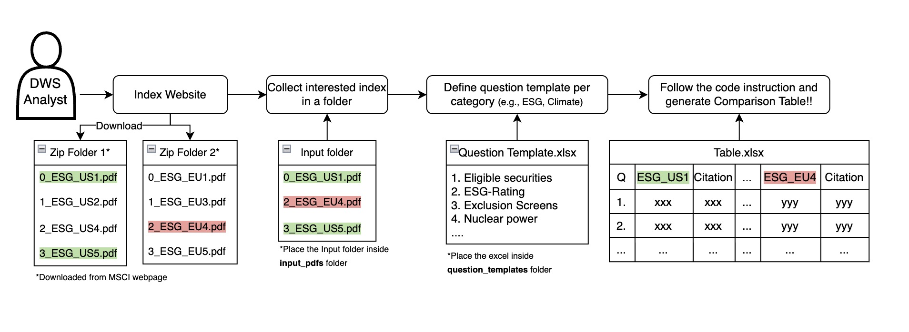

# AI-Enabled Index Investing



> Using this tool requires Git, Docker Desktop, and a terminal (Windows users need to use Ubuntu). If you don't have these dependencies already, find installation guides at the bottom of this page.

Run the following commands to pull the code locally:
```bash
git clone https://github.com/charlineshen/AI-Enabled-Index-Investing.git
cd AI-Enabled-Index-Investing
```

### Prepare the Following before Using the Tool:
* A folder containing the index documents PDFs. Make sure this folder is in the `input_pdfs` folder.
* An Excel file containing the question template, with the questions in the **second** column. Make sure the excel file is in the `question_templates` folder.
* Create a folder named `secrets` **parallel** to the `AI-enabled-Index-Investing` folder you just pulled. Create a text file named `API_KEY.txt` containing the [OpenAI API key](https://platform.openai.com/settings/profile/api-keys) in the `secrets` folder.

### Instructions to Use the Tool:
1. Launch Docker desktop.
2. Run the following command to start the Docker container.
    ```bash
    sh docker-shell.sh
    ```
3. Run the following command to process the documents and questions:
    ```bash
    python controller.py <index_folder_name> <question_template_excel_name>
    ```
    Specifically, this script will do the following:
    * Preprocess the index PDFs in the specified folder and save them as text files under the `inputs/` folder.
    * Chunk the text files into smaller pieces using the semantic spiltting algorithm.
    * Generate embeddings for each chunk and save them in a local ChromaDB instance.
    * Generate a comparison table where the rows will be questions, and the columns will be answers and citations corresponding to each index document.
    * An example command is `python controller.py test test_questions.xlsx`.
4. Find the comparison table in the `output_tables` folder. The output file name will be `<index_folder_name>.xlsx`

### Notes:
1. To avoid cost and duplicated effort, we will NOT process files with exact same name twice. If the content of files changed, please rename it.
2. The llm-rag-chromadb container is designed to be a persistent and ongoing service to host the Chroma database, so it does not stop upon exit. If necessary, shut it down manually, and the saved chunks and embeddings will be cleared.
3. If you are having trouble with ChromaDB HTTP connections, switch from `chromadb = "0.5.18"` to `chromadb = "0.5.11"` in `Pipfile`.
4. Reference installtion guides for dependencies:
    * Git can be installed [here](https://git-scm.com/book/en/v2/Getting-Started-Installing-Git).
    * Docker Desktop can be installed [here](https://www.docker.com/products/docker-desktop/).
    * For Windows users, commands need to be run in a Linux subsystem like [Ubuntu](https://ubuntu.com/desktop/wsl). For Mac users, commands can be run directly in the system terminal.